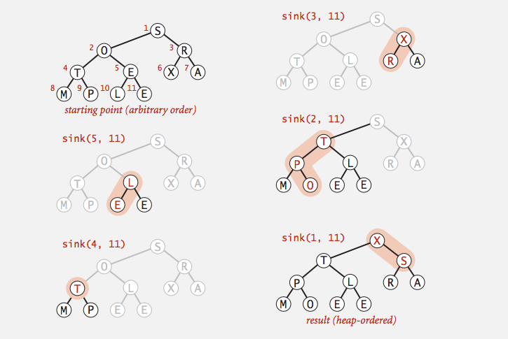
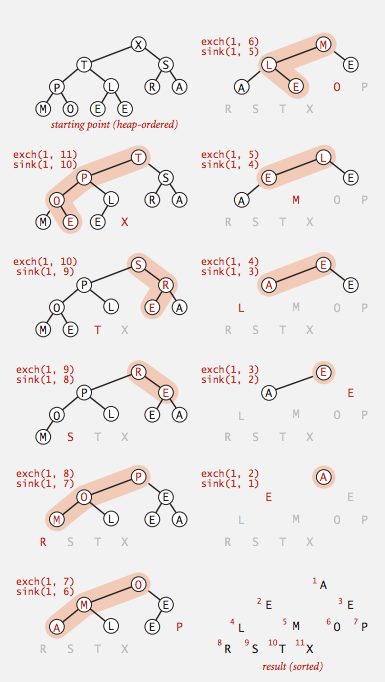

Title: Priority Queues
Date: 2015-09-29
category: data structure

## 定义

不同于 Stack 的 FIFO 和 Queue 的 FILO。Priority Queue 总是删除集合中最大（或最小）的数。例如


operation | argument | return value
------|------|------
insert|P|
insert|Q|
insert|E|
remove max||Q
insert|X|
insert|A|
insert|M|
remove max||X
insert|P|
insert|L|
insert|E|
remove max||P

如果使用数组来实现 Priority Queue 的插入和删除操作，需要的时间复杂度和理想的时间复杂度如下

implementation|insert|del max|max
--------------|------|-----|-----
unorded array|1|N|N
ordered array|N|1|1
<font color="#FF0000">goal</font>|<font color="#FF0000">logN</font>|<font color="#FF0000">logN</font>|<font color="#FF0000">logN</font>

有一种数据结构可以实现目标的时间复杂度，我们叫它做二叉堆

## Binary heaps

二叉堆有几个特点：

1. 它可以用一个数组来表示，不需要额外的数据结构。
2. 它是一颗完全二叉树。如果其子是 k，父节点就是 k/2
3. 对于最大堆来说，其父节点比其子节点都大，也就是说它的最大值是 k = 1


当子节点比父节点大时，需要对二叉堆作调整。基本思路是比较父节点和本节点，父节点比本节点大时交换节点数据。再比较父节点和父节点的父节点，直到顶为止。

```
private void swim(int k) {
    while (k > 1 && less(k/2, k)) {
        exch(k, k/2);
        k = k/2;
    }
}
```

### 插入

插入数组，往往是在数组末端添加数，但是这时可能会破坏堆的性质，需要使用 swim 函数作调整

```
public void insert(Key x) {
    pq[++N] = x;
    swim(N);
}
```


### 删除

删除节点，思路是将要删除的节点和最后一个节点交换，然后删除最后一个节点。但是这样会导致违反堆性质，所以需要使用 sink 作调整。

```
private void sink(int k) {
    while (2*k < N) {
        int j = 2*k;
        if (j < N && less(j, j+1)) j++;
        if (!less(k, j)) break;
        exch(k, j);
        k = j;
    }
}
```

```
public Key delMax() {
    Key max = pq[1];
    exch(1, N--);
    sink(1);
    pq[N+1] = null;
    return max;
}
```

由于 swim 和 sink 与树的高度有关，而这是一颗完全二叉树，树的高度总是 logN 。所以删除和插入的操作时间就是 logN，而最大值就是 k=1，所以时间复杂度是1。

## Heapsort

根据堆的特点，可以用来排序。第一步是要建立堆。

```
for (int k = N/2; k >= 1; k--)
    sink(a, k, N);
```

为什么要从 N/2 开始？请看图。



接着，就是每次把最大的数放到数组最后，然后数组大小减一，直到执行到数组头部。

```
while (N > 1) {
    exch(a, 1, N--);
    sink(a, 1, N);
}
```



建立堆的时间 <= 2N，排序的时间 <= 2NlgN

heapsort 是本地排序，最差时间为 NlgN。

堆排序的缺点

- 内循环时间比 quicksort 长
- 缓存利用率低
- 不是稳定排序


